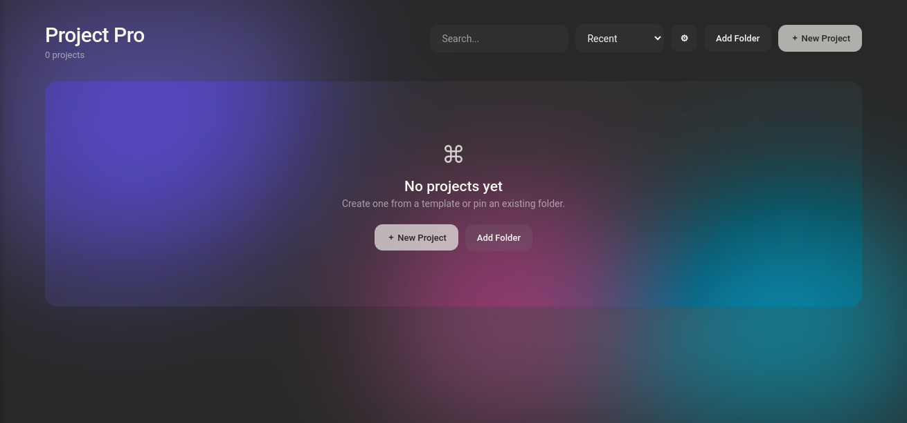

# 🚀 Project Pro

**A minimal, glassmorphism project dashboard for [Pulsar](https://pulsar-edit.dev)**

Launch your projects in style — pin folders, bootstrap new ones from
templates, and jump straight into work with a single click.

---

## 📸 Preview

> Drop a screenshot at `docs/screenshot.png` and it will appear right here.

## ✨ Features

- 🪟 **Glassmorphism dashboard** — frosted panels, ambient glow, smooth hover effects
- 🎨 **6 beautiful themes** — including one that *matches your editor theme automatically*
- 📦 **Project templates** — bootstrap Node.js, Python, Web or React projects in seconds
- ⚡ **Auto-launch** — opens as your home screen the moment Pulsar starts
- 🔍 **Live search & sorting** — by recency, name, or most-opened
- 🖱️ **Drag & drop** — drop any folder onto the dashboard to pin it
- 🔤 **Typography controls** — custom font family, size and title weight
- 📐 **Layout controls** — card width, corner radius, blur intensity, ambient glow
- 🌙 **Respects your system** — honors light/dark UI themes and reduced-motion preferences

## 🎨 Themes

| Theme | Description |
|---|---|
| **Aurora** | Colorful glass with ambient aurora blobs *(default)* |
| **Match Pulsar** | Inherits colors from your current editor theme |
| **Midnight** | Deep blue night sky with cold accents |
| **Daylight** | Light, clean, productivity-first surfaces |
| **Mono** | Strictly monochrome — zero distraction |
| **Custom** | Pick any accent color; the whole UI follows |

Switch themes instantly from the swatches in the header, or press
<kbd>Ctrl</kbd>+<kbd>Alt</kbd>+<kbd>Shift</kbd>+<kbd>T</kbd> to cycle through them.

## 📦 Templates

| Template | What you get |
|---|---|
| 🗂 **Empty** | A clean empty folder |
| 🟢 **Node.js** | `package.json` + `index.js` + `.gitignore` |
| 🐍 **Python** | `main.py` + `requirements.txt` + `.gitignore` |
| 🌐 **Web** | `index.html` + CSS + JS starter with assets |
| ⚛️ **React** | Zero-config single-file React app (CDN) |

Every template can optionally run `git init` for you.

## 📥 Installation

**From Pulsar (recommended):**
